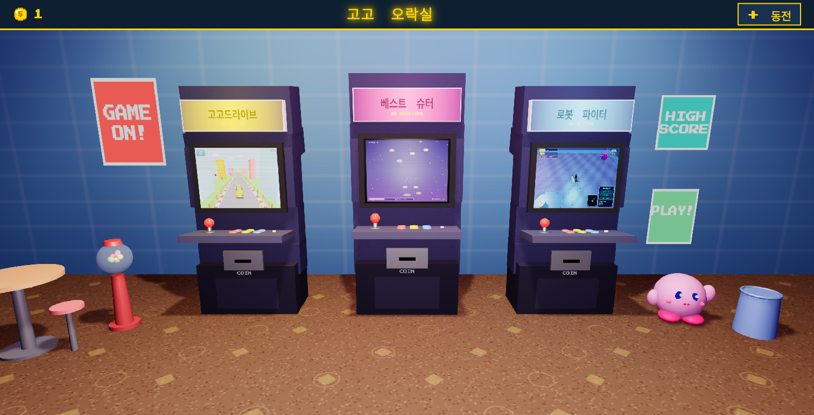
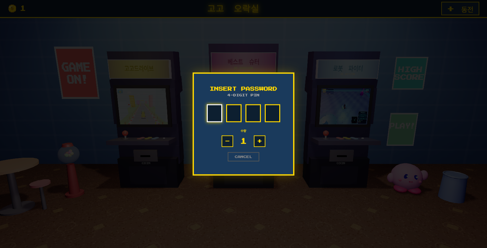

# 고고 오락실 (GogoPlayRoom)

Three.js 기반 3D 아케이드 게임룸입니다. 브라우저에서 실행되며, 3D로 구현된 오락실 공간에서 게임을 선택하고 플레이할 수 있습니다.



## 게임 목록

| 게임 | 장르 |
|------|------|
| 고고드라이브 | 3D 레이싱 |
| 베스트 슈터 | 2D 슈팅 |
| 로봇 파이터 | 3D 액션 |

## 플레이 방법

1. **비밀번호 설정** - 최초 실행 시 4자리 비밀번호를 설정합니다 (브라우저에 저장)
2. **동전 추가** - 우측 상단 `+ 동전` 버튼 클릭 → 비밀번호 입력 → 수량 선택
3. **동전 투입** - 오락기 하단의 코인 슬롯 클릭 (동전이 있으면 마우스 커서가 회전하는 3D 동전으로 변경)
4. **게임 시작** - `PRESS START` 깜빡일 때 스크린 클릭
5. **게임 종료** - `ESC` 키 또는 `EXIT` 버튼



## 기술 스택

- **Three.js** (r128) - 3D 렌더링, 절차적 모델링
- **Web Audio API** - 효과음
- **localStorage** - 동전 수량, 비밀번호 저장
- HTML / CSS / Vanilla JS

## 3D 씬 구성

- 절차적으로 생성된 아케이드 캐비닛 (마키, CRT 스크린, 조이스틱, 버튼, 코인 슬롯)
- 벽면 포스터, 테이블, 스툴, 껌볼 머신, 휴지통, 커비 오브젝트
- 브라운 카펫 바닥, 벽돌 패턴 벽면
- 마우스 호버 시 오락기 확대 효과
- 동전 투입/낙하 애니메이션

## 실행

로컬 HTTP 서버로 실행합니다.

```bash
python3 -m http.server 8080
# http://localhost:8080 접속
```

---

## 나만의 게임으로 커스터마이징하기

이 프로젝트를 fork하거나 clone해서 자신만의 게임을 넣을 수 있습니다.

### 1. 프로젝트 받기

```bash
git clone https://github.com/hyunsoogo/GogoPlayRoom.git
cd GogoPlayRoom
```

### 2. 게임 파일 준비

게임은 **단일 HTML 파일** 또는 **폴더** 형태로 준비합니다. iframe 안에서 실행되므로, 독립적으로 동작하는 웹 게임이면 됩니다.

```
games/
├── my-game/
│   ├── index.html      ← 게임 진입점
│   └── (기타 리소스)
├── another-game/
│   └── index.html
```

### 3. 게임 목록 수정 (`arcade.js`)

`arcade.js` 파일 맨 위의 `GAMES` 배열을 수정합니다.

```js
const GAMES = [
  {
    id: 'my-game',           // 고유 ID (영문, 중복 불가)
    title: '나의 게임',        // 오락기 마키에 표시될 제목
    path: 'games/my-game/index.html',  // 게임 HTML 경로
    color: '#FF4488',         // 테마 색상 (마키 배경, 조명 색)
    description: 'ACTION',    // 마키 하단 장르 텍스트
    screenshot: 'games/my-game/screenshots/gameplay.png',  // 스크린 미리보기 이미지
  },
  {
    id: 'another-game',
    title: '또 다른 게임',
    path: 'games/another-game/index.html',
    color: '#44BBFF',
    description: 'PUZZLE',
    screenshot: 'games/another-game/screenshots/gameplay.png',
  },
  // 최대 3개까지 (오락기 3대)
];
```

각 필드 설명:

| 필드 | 설명 |
|------|------|
| `id` | 게임 고유 식별자. 영문/숫자, 중복 불가 |
| `title` | 오락기 상단 마키에 표시되는 게임 제목. 한글 가능 |
| `path` | 게임 HTML 파일 경로 (프로젝트 루트 기준 상대 경로) |
| `color` | 테마 색상 (hex). 마키 배경 그라데이션, 조명 색에 사용 |
| `description` | 마키 하단에 표시되는 짧은 장르/설명 텍스트 (영문 권장) |
| `screenshot` | 오락기 스크린에 표시될 미리보기 이미지 경로 (PNG/JPG) |

### 4. 스크린샷 추가

각 게임 폴더에 `screenshots/gameplay.png` 파일을 넣어주세요. 이 이미지가 오락기 모니터에 표시됩니다.

- 권장 크기: **800x600** 이상
- 비율: 4:3이 가장 자연스러움
- 형식: PNG 또는 JPG

```
games/my-game/
├── index.html
└── screenshots/
    └── gameplay.png    ← 이 이미지가 오락기 스크린에 표시됨
```

### 5. 오락기 대수 변경 (선택)

기본은 3대입니다. 대수를 바꾸려면 `arcade.js`에서 배치 위치를 수정합니다.

```js
// 현재 3대 배치 (arcade.js 내)
const cabinetPositions = [-2.5, 0, 2.5];
```

- **2대**: `[-1.5, 1.5]`
- **1대**: `[0]`
- **4대 이상**: 간격을 줄이거나 카메라 위치 조정 필요

`GAMES` 배열의 길이와 `cabinetPositions` 배열의 길이를 맞춰야 합니다.

### 6. 소품/배경 커스터마이징 (선택)

`arcade.js`의 `createProps()` 함수에서 소품을 추가/제거/변경할 수 있습니다. 벽 색상, 바닥 카펫 색상 등도 같은 파일에서 수정 가능합니다.

### 7. 실행 및 확인

```bash
python3 -m http.server 8080
# 브라우저에서 http://localhost:8080 접속
```

### 주의사항

- 게임은 **iframe sandbox** 안에서 실행됩니다 (`allow-scripts allow-same-origin`). 외부 API 호출이 필요한 게임은 sandbox 속성 수정이 필요할 수 있습니다 (`index.html`의 `<iframe>` 태그).
- 게임 내에서 `ESC` 키를 누르면 오락실로 돌아옵니다. 게임 내에서 ESC를 별도로 사용하는 경우 충돌할 수 있습니다.
- 비밀번호와 동전 수량은 `localStorage`에 저장됩니다. 브라우저 데이터를 초기화하면 리셋됩니다.
- 비밀번호를 재설정하려면 브라우저 개발자 도구 콘솔에서 `localStorage.removeItem('arcade-pin')` 실행 후 새로고침하세요.
