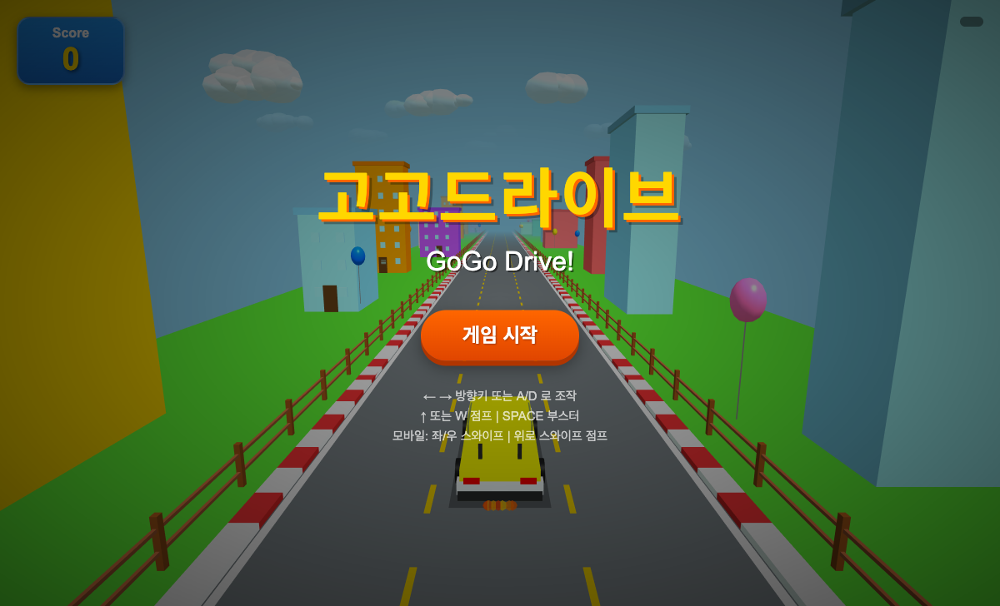
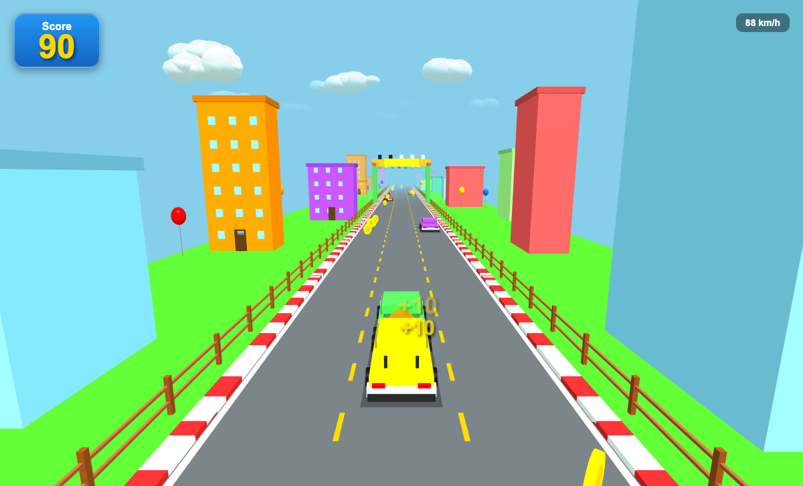

# 고고드라이브 (GoGo Drive!)

3D 아케이드 레이싱 게임 — Three.js 기반, 단일 HTML 파일로 구성

## 스크린샷

### 메뉴 화면


### 플레이 화면


## 플레이 방법

- **이동**: `←` `→` 방향키 또는 `A` / `D`
- **점프**: `↑` 또는 `W`
- **부스터**: `Space`
- **모바일**: 좌/우 스와이프로 이동, 위로 스와이프로 점프

## 특징

- 외부 모델/텍스처 없이 Three.js 프리미티브로 구성된 3D 그래픽
- Web Audio API를 활용한 절차적 사운드 생성 (오디오 파일 없음)
- 빌드 도구 불필요 — 브라우저에서 HTML 파일을 열면 바로 실행
- 난이도 자동 상승 시스템
- 로컬 랭킹 시스템 (localStorage 기반 Top 10)

## 실행

`고고드라이브.html` 파일을 브라우저에서 열거나, 정적 파일 서버로 실행:

```bash
python3 -m http.server
```
