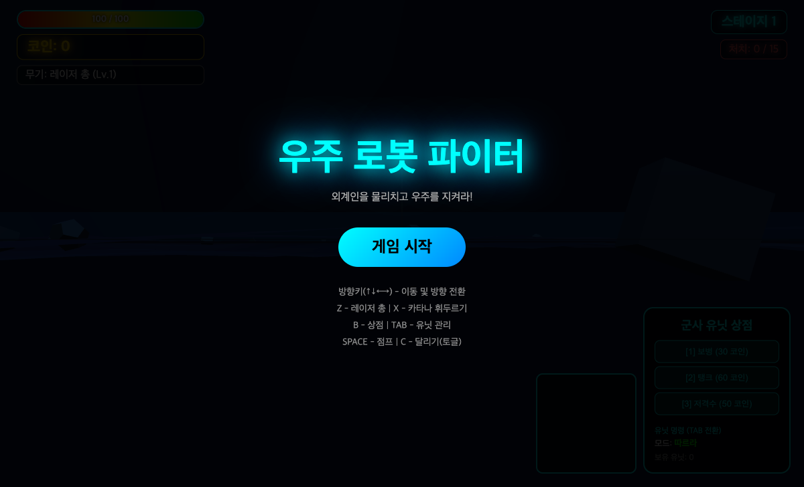
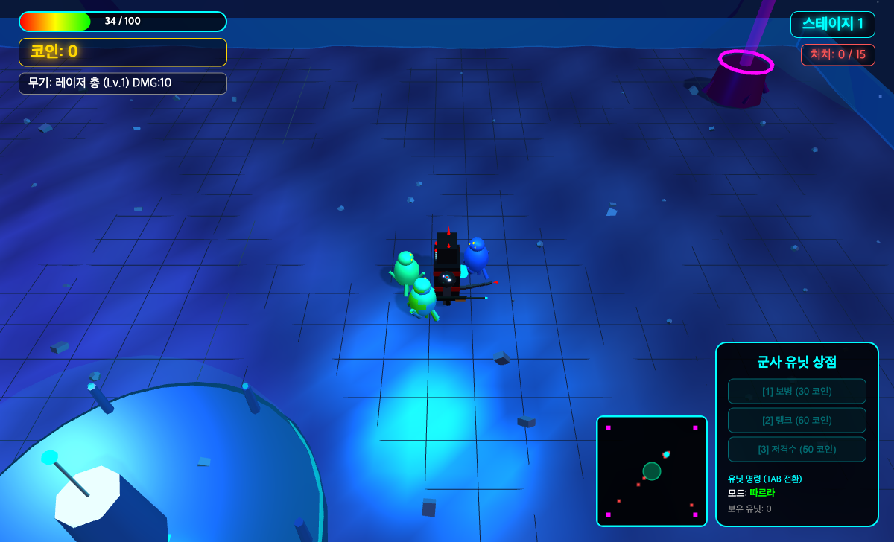

# 우주 로봇 파이터

Three.js 기반 3D 브라우저 액션 게임. 외계인을 물리치고 우주를 지켜라!

## 스크린샷

### 시작 화면


### 인게임


## 실행 방법

별도 설치 없이 `index.html`을 브라우저에서 열면 바로 플레이 가능합니다.

```bash
# 또는 로컬 서버로 실행
python3 -m http.server 8765
# http://localhost:8765/index.html 접속
```

## 조작법

| 키 | 동작 |
|----|------|
| ↑↓←→ | 이동 및 방향 전환 |
| Z | 레이저 총 발사 |
| X | 카타나 휘두르기 |
| Space | 점프 |
| C | 달리기 (토글) |
| B | 상점 |
| TAB | 유닛 모드 전환 |

## 게임 특징

- **쿼터뷰 3D 액션**: Three.js(r128) 기반 실시간 3D 렌더링
- **무기 시스템**: 레이저 총(원거리) + 카타나(근접) 전환 전투
- **스테이지 진행**: 적 처치 → 보스 출현 → 클리어 → 무기 강화
- **유닛 시스템**: 보병/탱크/저격수 아군 유닛 구매 및 명령(따르라/공격/방어)
- **절차적 사운드**: Web Audio API로 모든 효과음과 BGM을 실시간 합성 (외부 파일 없음)
