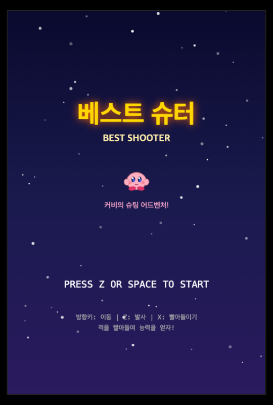
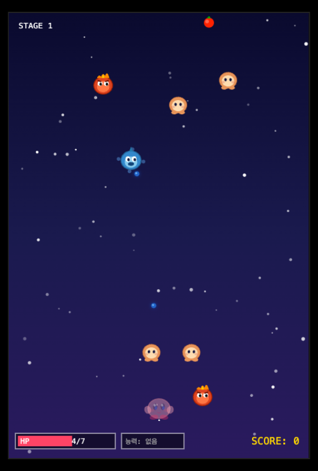
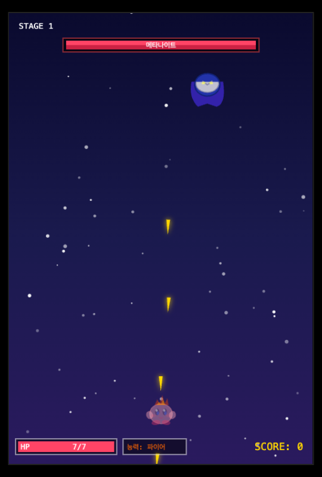

# 베스트 슈터 (Best Shooter)

커비 테마의 세로 스크롤 슈팅 게임입니다. HTML5 Canvas + vanilla JavaScript로 만들어졌으며, 브라우저에서 바로 플레이할 수 있습니다.

## 스크린샷

| 타이틀 | 플레이 | 보스전 |
|:---:|:---:|:---:|
|  |  |  |

## 플레이 방법

`index.html`을 브라우저에서 열면 바로 시작됩니다.

### 조작법

| 키 | 동작 |
|---|---|
| 방향키 / WASD | 이동 |
| Z / Space | 발사 |
| X | 빨아들이기 (적의 능력 흡수) |

## 게임 특징

- **능력 시스템**: 적을 빨아들여 능력을 획득 (파이어 - 관통 공격, 워터 - 3방향 확산)
- **2개 스테이지**: 드림랜드의 하늘 (보스: 메타나이트) → 어둠의 요새 (보스: 기간트 에지)
- **보스 패턴**: 각 보스마다 고유한 공격 패턴, HP 40% 이하 시 2페이즈 돌입
- **효과음**: Web Audio API 기반 (외부 파일 불필요)
